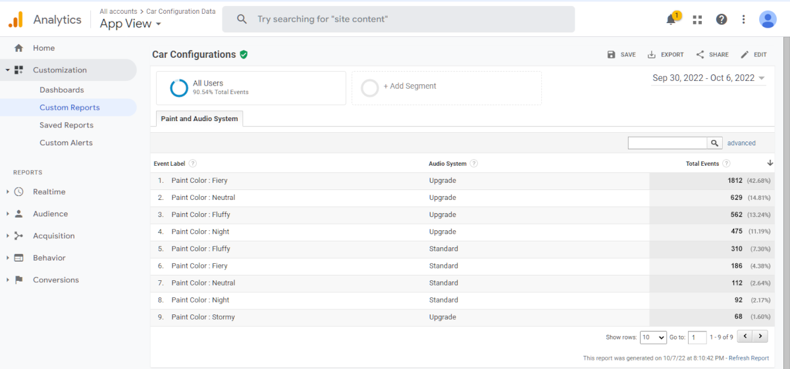
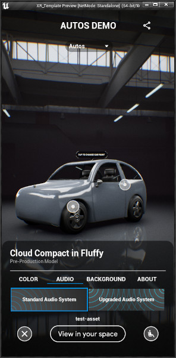
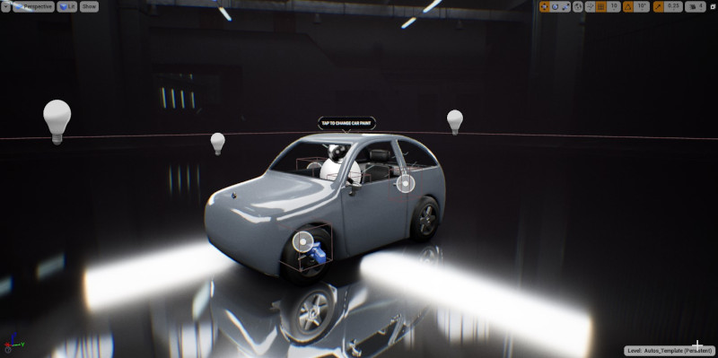

# Google Analytics with Immersive Stream for XR - Unreal Engine demo

This project is a public demo for the plugin "*[Google Analytics Measurement Protocol](https://www.unrealengine.com/marketplace/google-analytics-measurement-protocol)*" for Unreal Engine, integrated with the official [template for Immersive Stream for XR](https://github.com/GoogleCloudPlatform/immersive-stream-for-xr-templates).
The demo consists of a simple car configurator that logs the user choices to Google Analytics.

**ATTENTION: a copy of the plugin is required to use this project.**

**ATTENTION: the project must be configured with a Google Analytics Tracking ID before use. Detailed instructions are provided in the video tutorial below, or in the section ["Plugin configuration"](https://www.unamedia.com/ue5-google-analytics/api/#main_quickstart_config) of the documentation.**

A complete **video tutorial** covering this demo and the setup of Google Analytics is available here: **LINK**

*This demo is the result of a collaboration between the team of Google Cloud's [Immersive Stream for XR](https://xr.withgoogle.com/) and [UNAmedia](https://www.unamedia.com/).*

## Google Analytics Measurement Protocol - plugin

[Google Analytics Measurement Protocol](https://www.unrealengine.com/marketplace/google-analytics-measurement-protocol) is a plugin for Unreal Engine to easily log application and game events to [Google Analytics](https://developers.google.com/analytics), using a native cross-platform implementation. The plugin doesn't require any third-party dependency and it's compatible with all the platforms supported by Unreal Engine (including desktop and consoles).

Simply enabling and configuring the plugin is enough to start to receive key usage data of your game/application.

More information are available in the [documentation](https://www.unamedia.com/ue5-google-analytics/api/).

## Links

Video Tutorial: **LINK**

"Google Analytics Measurement Protocol" plugin:

- Marketplace: <https://www.unrealengine.com/marketplace/google-analytics-measurement-protocol>
- Documentation: <https://www.unamedia.com/ue5-google-analytics/api>

Immersive Stream for XR: <https://cloud.google.com/immersive-stream/xr>

